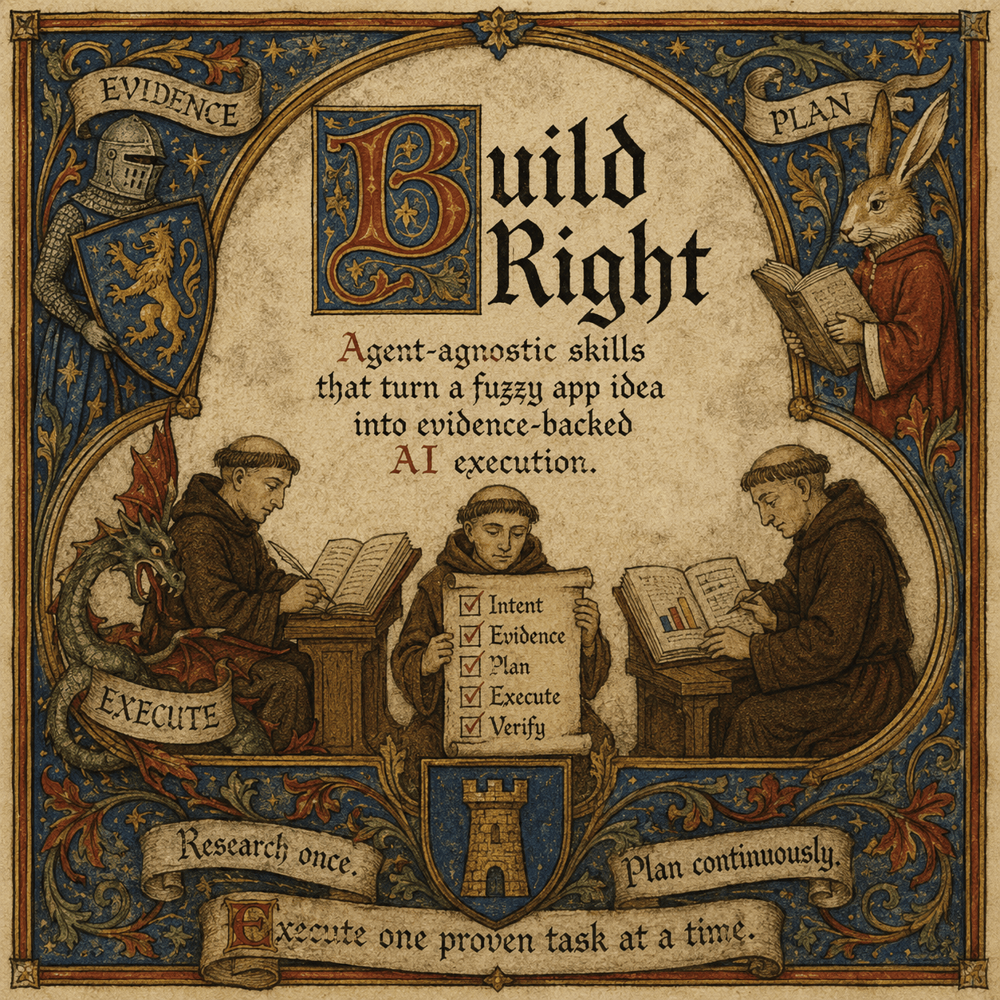
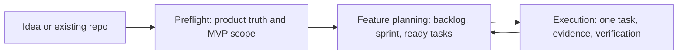
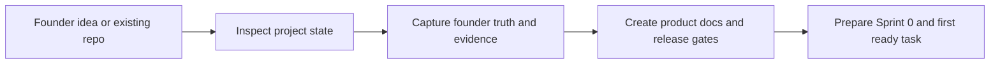
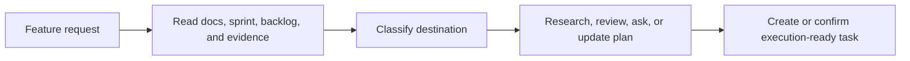
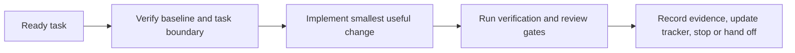

# Build Right



Agent-agnostic skills that turn a fuzzy app idea into evidence-backed AI
execution.

Build Right gives AI agents a product workflow before they write code: capture
founder intent, separate evidence from assumptions, plan repo-native work, and
execute one bounded proven task at a time.

```text
Research once. Plan continuously. Execute one proven task at a time.
```



## Why This Exists

AI agents can move quickly, but speed is not enough when the starting point is a
half-formed product idea, stale repo state, or unvalidated assumptions. Build
Right is for founders and product engineers who want agents to work from
explicit product truth, current evidence, and small verifiable tasks instead of
guessing what to build next.

The goal is not more process. The goal is to make the next agent action obvious,
bounded, and checkable.

## Motivation

Build Right came out of the startup-builder loop described in
["All roads led to Markdown"](https://paxdynamics.com/blog/build-right): idea
triage led to app-factory thinking, app-factory thinking led to AI control
planes, control planes led to agent governance, and the useful part that kept
surviving each layer was a lightweight harness around the work.

That harness did not need to start as another platform. It could start as
Markdown skills: explicit workflows, inputs, outputs, stop gates, evidence
contracts, and review points that make agent work inspectable before it becomes
infrastructure.

## Quickstart

Install all Build Right skills from GitHub:

```sh
bunx skills add pax-k/build-right
```

This installs 3 lifecycle skills (`build-right-preflight`,
`build-right-feature-planning`, `build-right-execution`) plus 1 cross-cutting
engineering standard (`build-right-engineering-principles`).

Then invoke the skill for the phase you are in:

**Preflight**

```text
$build-right-preflight

Bootstrap this existing project for evidence-driven AI execution.
```

**Feature planning**

```text
$build-right-feature-planning

Explore this feature request, update the project sprint/task plan, and stop
before implementation.
```

**Execution**

```text
$build-right-execution

Take the next ready task and complete it with evidence.
```

Some agents may also expose installed skills as slash commands:

```text
/build-right-preflight
/build-right-feature-planning
/build-right-execution
/build-right-engineering-principles
```

## Running With Agentic Loops

`build-right-execution` is designed to be run inside an outer agent loop. The
skill still executes one bounded task at a time; the agent loop decides whether
it is safe to advance to the next task.

Use a goal or driver prompt like this:

```text
Use $build-right-execution.

Objective: execute ready AI-owned tasks in <target repo> one at a time until
blocked or human input is required.

Loop rules:
- Before selecting each task, run
  `bun <build-right-execution-path>/scripts/continue-check.ts --cwd <target repo> --format markdown --strict`
  and report its decision.
- Continue only when the resolver returns execute-task or
  continue-active-task.
- Complete exactly one bounded task per iteration with baseline evidence,
  verification, evidence log, and tracker updates.
- After each task, rerun the full Bun resolver command and the stop-gates check.
- Continue only if the next task is ready, AI-owned, evidence-backed, and has no
  stop/ask gate.
- Stop and report the exact gate when founder input, external state, failed
  verification, stale or ambiguous evidence, source mismatch, open conflict,
  non-AI ownership, release-claim risk, or unavailable required review appears.
```

The loop belongs to the agent runner, not inside the skill. `build-right-execution`
provides the checkpoint contract: resolve state, execute one task, verify,
record evidence, update the tracker, then resolve state again before advancing.

## Use Cases

Use Build Right when you need to:

- turn a founder brain dump into MVP scope, release gates, and first tasks;
- add a feature to an existing repo without skipping planning and tradeoff work;
- keep AI implementation focused on one ready task at a time;
- require evidence, tests, and tracker updates before closing work;
- preserve project decisions in repo files instead of chat history.

This is probably not a fit if you need:

- a no-code app generator;
- one-shot prompting with no repo artifacts;
- hosted project management software;
- customer validation done by public web research alone;
- provider-specific agent wiring instead of portable skill instructions.

## Lifecycle

Build Right is a three-skill lifecycle.

| Phase | Skill | When to use it | Result |
| --- | --- | --- | --- |
| Preflight | `build-right-preflight` | Once, when the project or idea needs product grounding. | Founder intent, assumptions, MVP scope, operating docs, and first execution-ready work. |
| Feature planning | `build-right-feature-planning` | Repeatedly, when a new feature or product change needs shaping. | Updated backlog, sprint/docs changes, and ready task files. |
| Execution | `build-right-execution` | Repeatedly, after there is a ready task. | One implemented task with baseline evidence, verification, tracker updates, and closeout. |

`build-right-engineering-principles` is not a lifecycle phase. It is a
cross-cutting standard the workflow skills may load for architecture,
contracts, provider boundaries, implementation review, tests, observability,
security, and enforceable engineering-policy decisions.

## Skill Flows

These are the high-level paths. The full operational diagrams, including
helper lanes, research, delegation, evidence states, and stop gates, live in
[`docs/agent-skills-flow-diagrams.md`](docs/agent-skills-flow-diagrams.md).

### Preflight



### Feature Planning



### Execution



## Features

- **Evidence-backed product setup** - separates founder truth, public research,
  assumptions, conflicts, and MVP decisions before implementation starts.
- **Continuous planning loop** - turns feature ideas into bounded research,
  backlog updates, sprint changes, and ready tasks without leaking into code.
- **One-task execution discipline** - verifies the starting state, implements the
  smallest useful change, records evidence, and stops at the next decision point.
- **Agent-agnostic instructions** - uses portable `SKILL.md` workflows,
  references, and templates instead of provider-specific metadata.
- **Deterministic gates** - read-only Bun helpers report project state and next
  actions so humans and agents can inspect the same decision surface.
- **Repo-native artifacts** - writes durable docs and task files in the target
  project instead of treating chat as the source of truth.
- **Engineering standards** - applies `build-right-engineering-principles` as a
  cross-cutting review lens for boundaries, contracts, adapters, effects,
  errors, tests, observability, and security.
- **Visible closeout badges** - ends skill responses with a restrained status
  badge such as `🟢 [GREEN] Status: ALL GREEN`,
  `🟡 [YELLOW] Status: NEEDS INPUT`, or
  `🔴 [RED] Status: BLOCKED`.

## How It Works

Each skill is instruction-first:

1. `SKILL.md` defines the phase workflow.
2. `references/` carries deeper gates, contracts, and delegation rules.
3. `assets/templates/` provides reusable Markdown artifacts for target repos.
4. read-only Bun scripts surface deterministic state and next-action signals.

The engineering-principles skill is reference-first: its `SKILL.md` explains
when to use it, and `references/principles.md` carries the reusable standard.

Every skill response should close with exactly one visible status badge. Raw
emoji provide quick scanning, and GitHub-style shortcodes remain visible when a
renderer does not display emoji glyphs. Helper scripts stay emoji-free so their
deterministic output remains easy to parse.

The stable safety model is in [`workflow-backbone.md`](docs/workflow-backbone.md):
observe state, classify it, choose one next action, run gates, act, verify,
record, then stop or continue.

Helper decisions are intentionally small and explicit:

- preflight can return `delegate-inventory`, `ask-founder`, `run-research`,
  `write-artifacts`, `create-sprint0`, `ready-for-execution`, or `blocked`.
- feature planning can return `route-preflight`, `ask-founder`, `run-research`,
  `delegate-review`, `update-roadmap`, `update-sprint`, `create-ready-tasks`,
  or `blocked`.
- execution can return `execute-task`, `continue-active-task`, `ask-founder`,
  `wait-external`, `create-blocker`, `no-ready-task`, or `invalid-state`.

The deterministic helper files are `preflight-check.ts`,
`feature-planning-check.ts`, `continue-check.ts`, and `execution-check.ts`.
Release checks run through `bun test` and `bun run verify:skill-trials`.
Generated target-project artifacts belong in the target repo; Build Right source
does not commit generated `docs/` or `tasks/`.

Founder input remains the source of product truth. Public research can support
prototype assumptions or public evidence, but it does not become customer
validation. Subagents may gather, draft, critique, and audit; the main agent
still decides, writes, updates trackers, and closes gates.

## License

[MIT](LICENSE)
