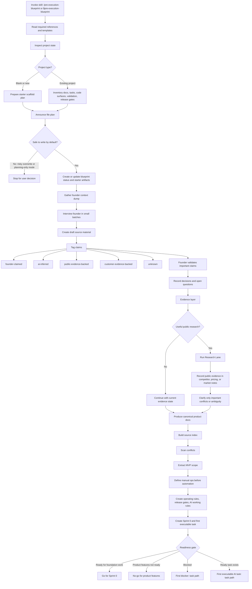
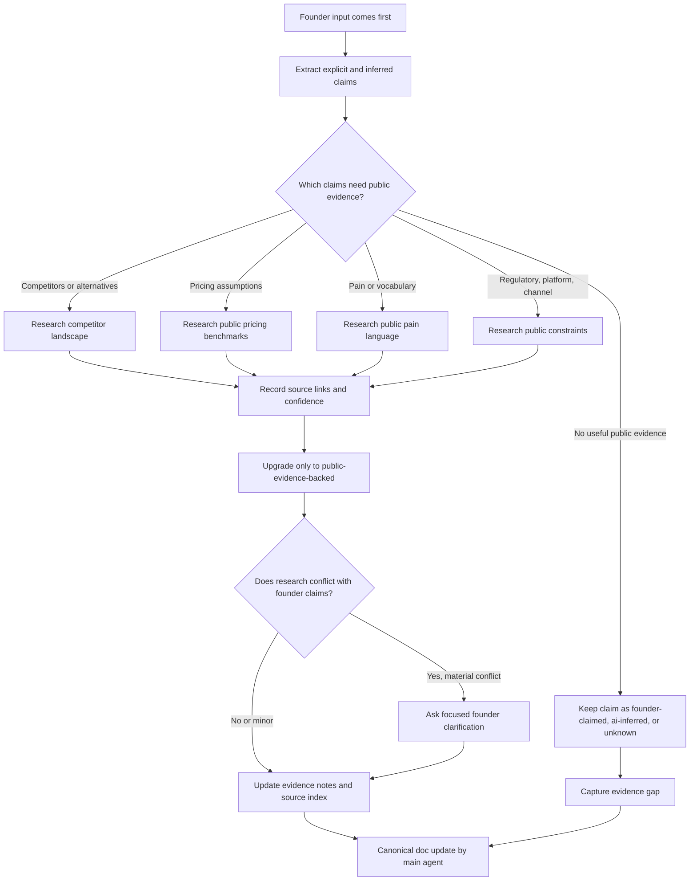
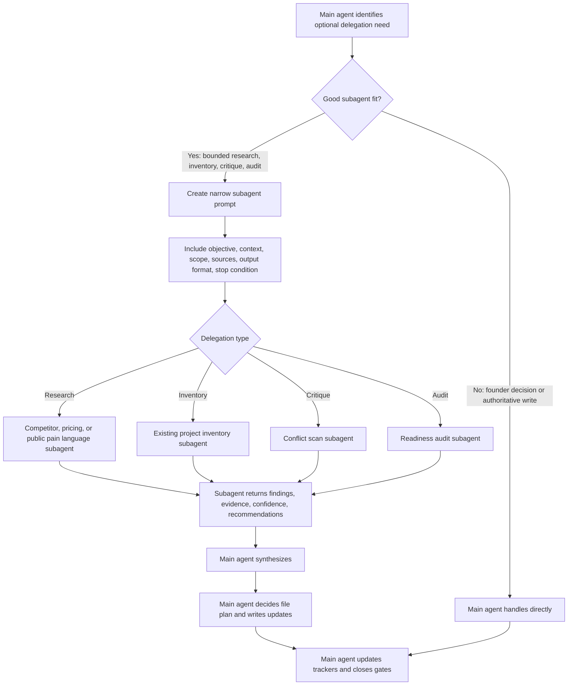
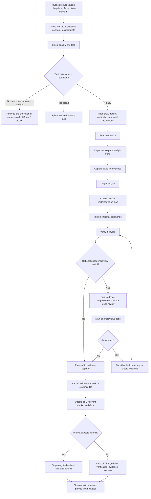
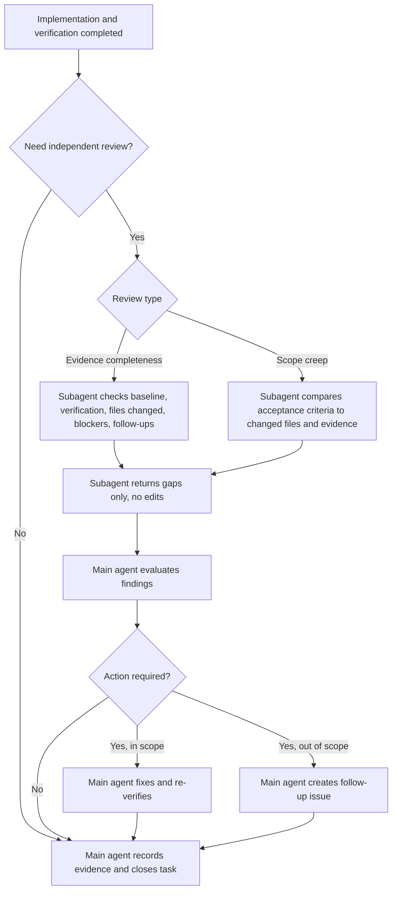
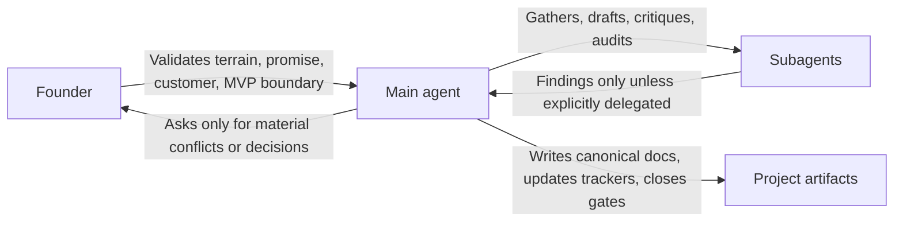

# Agent Skills Flow Diagrams

This document visualizes the implemented flows for:

- `skills/pre-execution-blueprint`
- `skills/execution-blueprint`

The diagrams are intentionally operational: they show what the main agent does,
where founder input is required, where web research or subagents may help, and
where files are created or updated.

## Pre-Execution Blueprint

## Pre-Execution Research Lane

## Pre-Execution Delegation Lane

## Execution Blueprint

## Execution Subagent Review Lane

## Ownership Boundary

