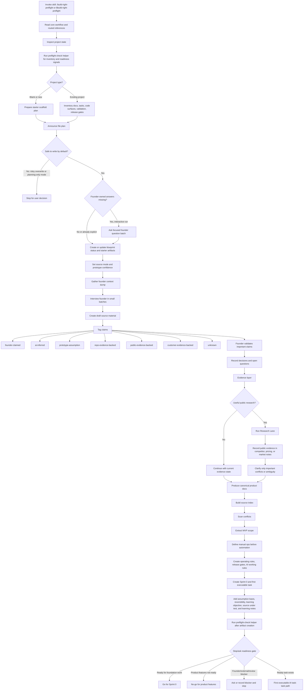
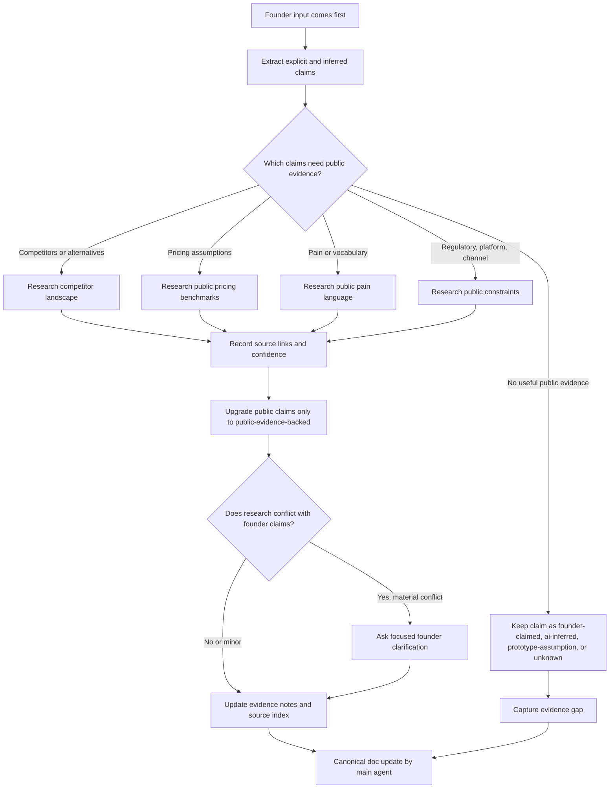
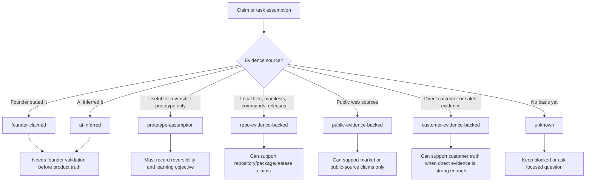
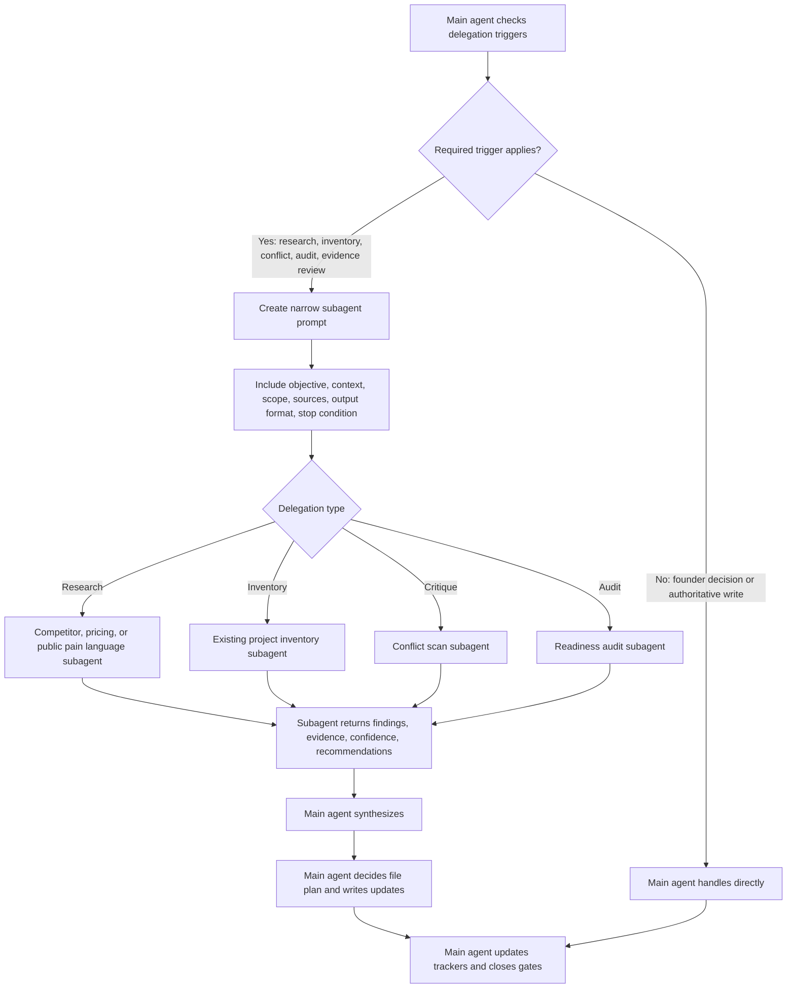
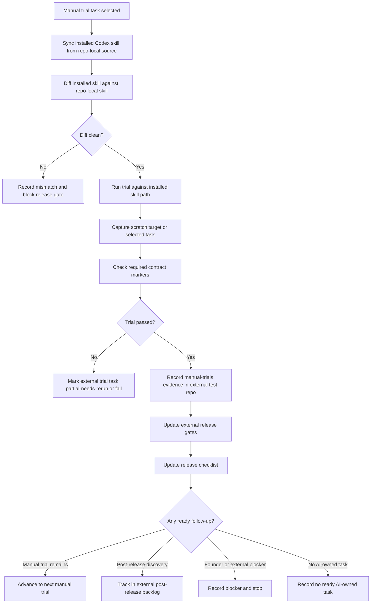
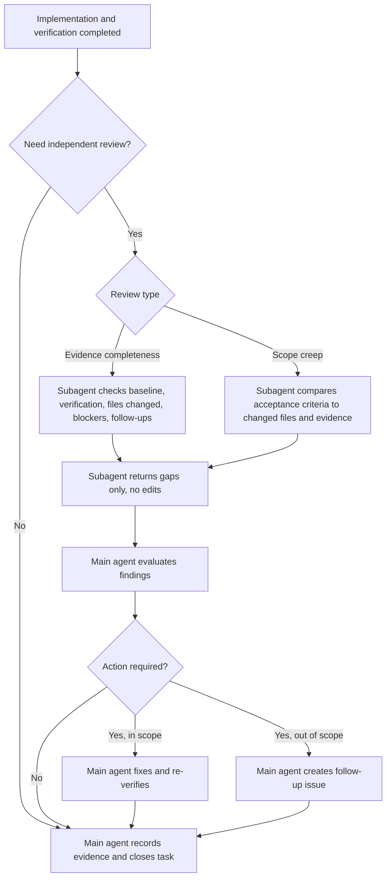
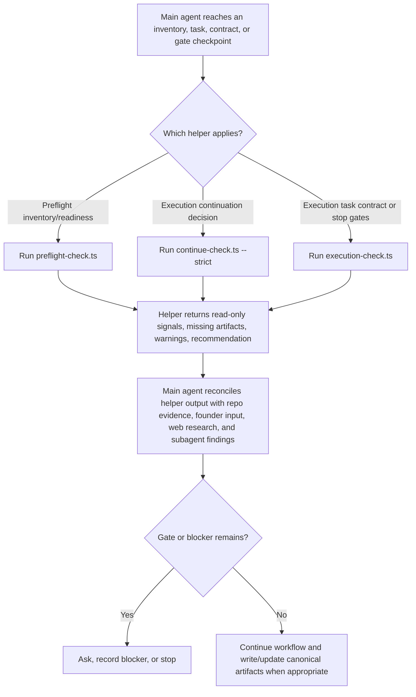
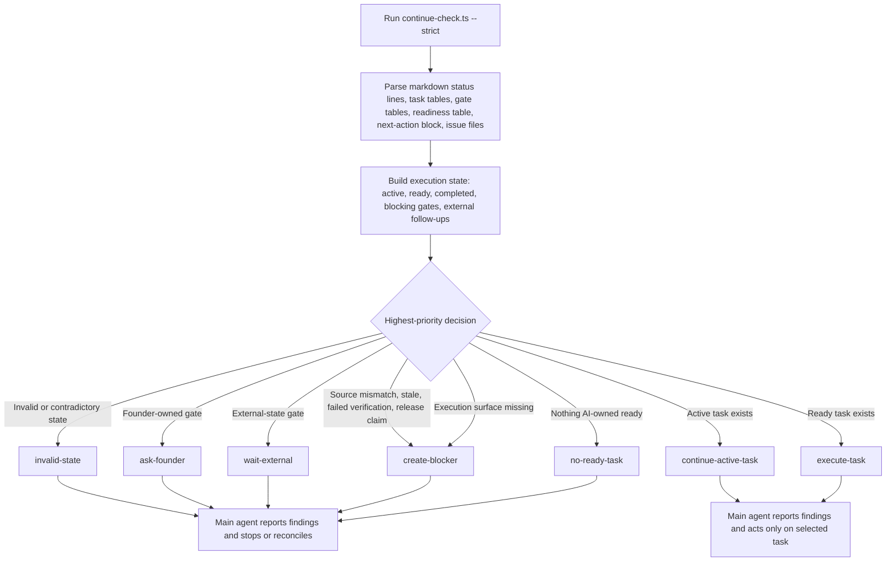
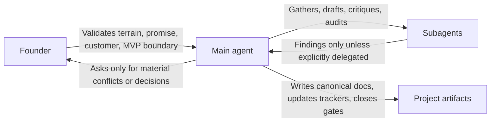

# Agent Skills Flow Diagrams

This document visualizes the implemented flows for:

- `skills/build-right-preflight`
- `skills/build-right-execution`

The diagrams are intentionally operational: they show what the main agent does,
where founder input is required, where web research or subagents may help, and
where files are created or updated.

## Build Right Preflight

## Pre-Execution Research Lane

## Evidence Status Contract

## Pre-Execution Delegation Lane

## Build Right Execution

```mermaid
flowchart TD
  A["Invoke skill: /build-right-execution or $build-right-execution"] --> B["Read workflow, gates, evidence contract, and routed references"]
  B --> B0["Run continue-check --strict state resolver"]
  B0 --> B00["Report decision, confidence, next action, next task, blocking gates, and external follow-ups"]
  B00 --> B1{"Resolver decision?"}
  B1 -->|"ask-founder, wait-external, invalid-state, no-ready-task"| B2["Ask, report blocker, or stop"]
  B1 -->|"create-blocker"| B3["Create or propose smallest AI-owned blocker"]
  B1 -->|"continue-active-task or execute-task"| B4["Run execution-check next-task helper"]
  B4 --> C["Select exactly one task"]
  C --> D{"Task exists and is bounded?"}

  D -->|"No task or no execution surface"| E["Route to pre-execution or create smallest Sprint 0 blocker"]
  D -->|"Too broad"| F["Split or create follow-up task"]
  D -->|"Ready"| G["Read task, tracker, authority docs, local instructions"]

  G --> G1["Record assumption basis, reversibility, learning objective, source under test"]
  G1 --> H["Print task intake"]
  H --> H1["Run execution-check task-contract helper"]
  H1 --> I["Inspect workspace and git state"]
  I --> J{"Skill/manual trial?"}
  J -->|"Yes"| J1["Compare installed source with repo-local source"]
  J -->|"No"| J2["No source comparison needed"]
  J1 --> J3{"Source matches?"}
  J3 -->|"No"| J4["Record mismatch, mark partial-needs-rerun, do not advance gate"]
  J3 -->|"Yes"| J2
  J2 --> K["Capture baseline evidence"]
  K --> L["Diagnose gap"]
  L --> M["Create narrow implementation plan"]
  M --> N0["Implement smallest change"]
  N0 --> N["Verify in layers"]

  N --> O{"Required review trigger or useful review?"}
  O -->|"Yes"| P["Run evidence completeness or scope creep review"]
  O -->|"No"| Q["Proceed to evidence capture"]

  P --> R["Main agent reviews gaps"]
  R --> S{"Gaps found?"}
  S -->|"Yes"| T["Fix within task boundary or create follow-up"]
  T --> N
  S -->|"No"| Q

  Q --> U["Record evidence, learning notes, files changed, blockers, follow-ups"]
  U --> V["Update only relevant tracker and docs"]
  V --> V0["Run continue-check --strict state resolver"]
  V0 --> V01["Report resolver findings before selecting more work"]
  V01 --> V00["Run execution-check stop-gates helper"]
  V00 --> V1{"Stop/ask gate before next task?"}
  V1 -->|"Gate hit"| V2["Ask, record blocker, or stop"]
  V1 -->|"No gate"| W{"Project expects commit?"}
  W -->|"Yes"| X["Stage only task-related files and commit"]
  W -->|"No"| Y["Hand off changed files, verification, evidence, blockers"]
  V2 --> Y
  X --> Z["Closeout with what was proved and next task"]
  Y --> Z
```

## Manual Trial Release Gate

## Execution Subagent Review Lane

## Deterministic Helper Lane

## Continue State Resolver

## Ownership Boundary

